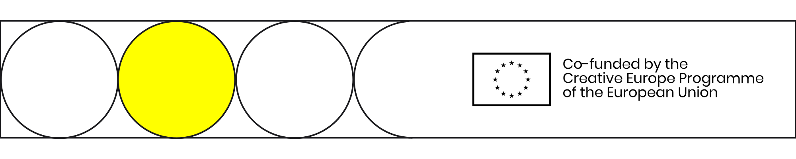

# 〰 Technology

Distributed Design has its origins in the citizen-led maker movement and as such this toolkit sits in the context of countless online tutorials for open source and open access technologies; throughout the toolkit we point to links where some of these can be found.&#x20;

We believe that technological skills are best self taught by doing and this toolkit does not have any digital fabrication or workshop tutorials. Instead this toolkit focuses on core concepts and approaches needed in distributed design.&#x20;

This page will be updated with a list of related skills and technologies for distributed design.

