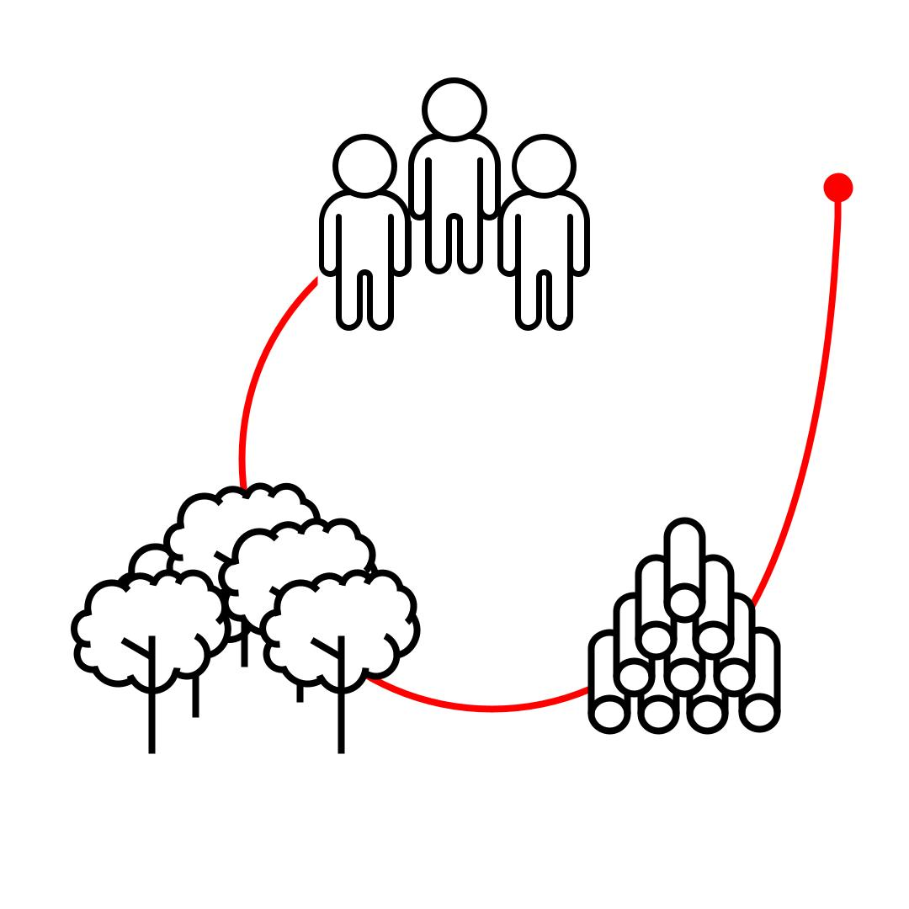

# 〰 Sustainability

## ​🎯 **Invitation**

Sustainability in design is often mis-interpreted as creating 'eco' products. This page invites you to unpack the complexity of sustainability so that you can design in a way that distributes impact and value fairly.&#x20;

## 👀 **Overview**

John Elkinton’s **triple bottom line** business metaphor of People Planet, Profit (PPP) is a way into the complexity of sustainability.&#x20;

PPP is a gateway to discussion around sustainability and is a useful tool for auditing the impact of your work and of other products.&#x20;



If you **sustain** something, you continue it or maintain it for a period of time \[[collins](https://www.collinsdictionary.com/dictionary/english/sustain)]. **Growth** on the other hand is defined as a gradual development in maturity, age, size, weight or height- applied to living things growth leads to an end point or death.&#x20;

.jpg>)



In this simplified diagram of a timber company, immediate growth and profit is prioritised at the expense of future prosperity. If wealth and resources are not reinvested into the people working for the company and new trees are not planted very soon the business will fail.&#x20;




Planting new trees and maintaining a healthy bio diverse plantation whilst investing in education and well being of workers and their families will sustain the business for the future.&#x20;




Although simple this abstraction shows that it is important to de-center the designers focus from the usual one of consumer or **Profit** to also consider the inter-connectedness of **People** and the **Planet**.

.jpg>)




Triple bottom line (3 pillars): sustainability in business



This whiteboard animation video from Youtube presents the concept of the triple bottom line and uses science to suggest a different way to look at it. This provides businesses with new perspective on the rationale for integrating sustainability into who and how they are in the world. This is also known as the 3 pillars of sustainability.



It should be noted that in 2018 John Elkington [recalled the model](https://johnelkington.com/2018/07/recalling-the-triple-bottom-line/).&#x20;

It was supposed to provoke deeper thinking about capitalism and its future - ots goal was **system change **— pushing toward the transformation of capitalism.  However It ended up being misused by corporations as a [green washing](https://en.wikipedia.org/wiki/Greenwashing) tool.&#x20;

After using it as an introduction your should develop your literacy around sustainability with more complex impact modelling found in the [further reading](people-planet-profit.md#resources)



## ✏ Activity: balancing impacts



## 📝 Further reading









