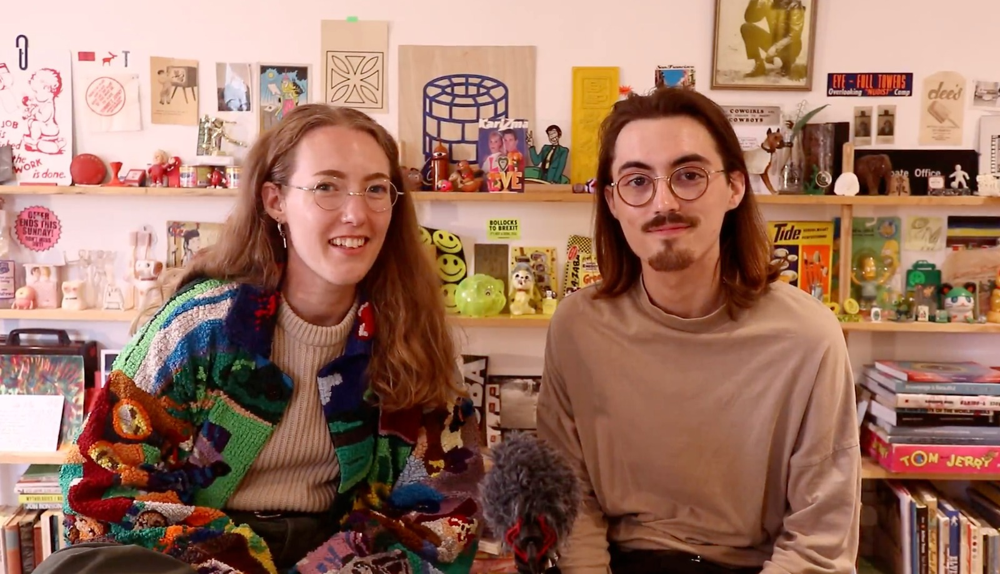
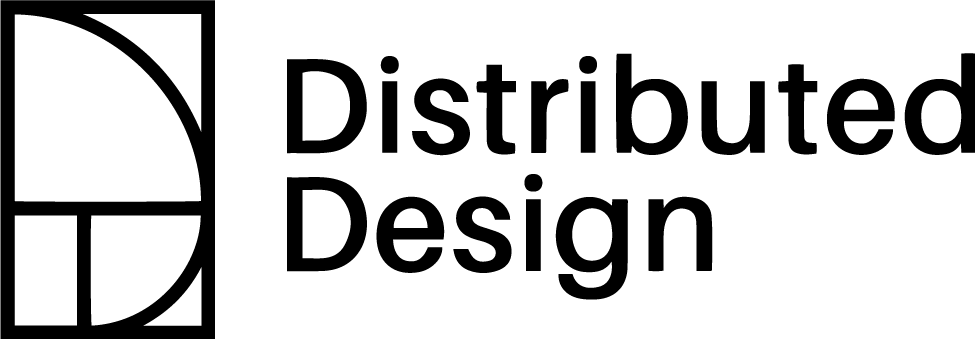
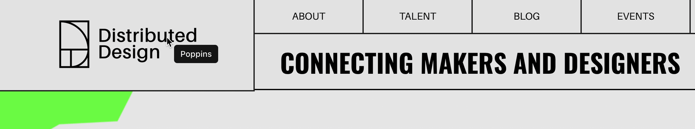

# 📢 Manifesto + Identity

## Contents

1. [Invitation](your-graphic-identity.md#invitation)
2. [Introduction](your-graphic-identity.md#introduction)
3. [Typography](your-graphic-identity.md#typography)
4. [Exercise: Type Suitability](your-graphic-identity.md#type-suitability-activity)
5. [Choose Your Typeface](your-graphic-identity.md#choose-your-type)
6. [Colour](your-graphic-identity.md#colour)
7. [Exercise: Colour Palette](your-graphic-identity.md#colour-palette-activity)
8. [Making Your Manifesto](your-graphic-identity.md#making-your-manifesto)
9. [Snootie's Resources](your-graphic-identity.md#snooties-resources)

## ****:dart: **Invitation**

Take inspiration from the work of Snootie studio to develop your own graphic identity.&#x20;

Start by looking at the three tabs below.



## **🍏🍎  Who are Snootie Studios?**

Snootie Studios is a creative studio specialising in Graphic Design and Illustration. They work on projects across a broad range of disciplines, including online facilitation, branding, print and publication, motion design, packaging and merchandise. Snootie have been invited to share their knowledge to improve the desirability and messaging of distributed design projects.&#x20;





In Distributed Design the way you communicate your project is as important as the product itself. Makers of our designs encounter them as instructions and recipes hosted and shared online.&#x20;

We want consumers/ citizens to choose Distributed Designs over mass-produced products. A strong graphic identity for the designer and brand for the product is key to this desirability.&#x20;

The purpose of this section of the toolkit is&#x20;

* To understand graphic identity
* To choose suitable fonts and colours
* To apply them to a manifesto that conveys your personal position



1. You need to have completed [Start with Why](exercise-start-with-why.md) before this section
2. Read this section top to bottom first
3. Do the [Type Suitability activity](your-graphic-identity.md#type-suitability-activity)
4. Do the [Colour Palette activity](your-graphic-identity.md#colour-palette-activity)
5.  Do the [Manifesto activity](your-graphic-identity.md#making-your-manifesto)




## 👀 Introduction

Similar to your personality, a graphic identity is what sets you apart from others in your field and makes you, uniquely you. Your identity is the result of a combination of graphic components that is made to convey a message and tone of voice to its intended audience.&#x20;

### Glossary



**A symbol or icon that represents your brand.** It does not actually need to bear any literal connection to brand name, but does need to spearhead the visual identity. Circle or square format is best in the era of profile pictures and tab icons.



**This is a logo that bears the name or initials of your brand. **It can include elements of the Logomark to help tie into branding, but is not always needed. This is usually a display font because style and the application of it at different sizes takes priority over legibility.



**By typography, we mean the typefaces your brand use when delivering different types of information. **'Display' typefaces are intended to draw attention to crucial information. Longer text, such as paragraphs are usually written in 'Body' typefaces. They are often in an easy-to-read typeface that complements the display typeface.



**It is usual to choose three to five colours that can be used on different parts of your main branding. **For example, lighter/brighter colours for backgrounds & darker colours for symbols, icons & illustrations. It is wise to include black & white as two extra colours, you will very often use black type on a white background.&#x20;

Remember different colours have different social/cultural meanings. **What colours will best communicate your brand to your audience?**



### Case Study: Distributed Design




.png>)

The Logomark for Distributed Design hides two easter eggs within its clean, and confident style. \
\
First, the curve and the outer box meet up to form a letter D as a nod to the name of the brand. Second, the logo is based off of the Golden Spiral, a logarithmic spiral based approximated by Fibonacci's Golden Ratio Φ. The golden ratio represents a universal rule that denotes the "ideal" in all forms of life and matter, which speaks to the values of Distributed Design.




The Distributed Design logotype pairs the brand name and logo in a way that creates coherence between the two. See how the weight of the typeface compliments the weight of line in the logo, unifying the elements.&#x20;




Typefaces used: [Poppins](https://fonts.google.com/specimen/Poppins), a geometric nearly monolinear sans serif typeface for the logo, [Aileron](https://fonts.adobe.com/fonts/aileron#fonts-section), a Neo-Grotesque sans serif typeface for the main text and headers, and [Oswald](https://fonts.google.com/specimen/Oswald#standard-styles), a modern rework of the 'Alternate Gothic' sans serif typeface.\
\
When picking a typeface, usage is really important to think about. All of these typefaces are **open source**, which very much conveys the message Distributed Design is trying to convey.

A 'Display' typeface — Oswald — contrasts the more extensive bodies of text that will be set in Aileron. Oswald is a great choice and gives a nod to classic design styles, sitting nicely against Aileron which conveys a clean and efficient style.




The colour scheme that Distributed Design have chosen for their brand colours is really interesting, because at first you might think that they have just chosen a wide span of colours to have lots of options. However, these specific tones are similar to the standard CMYK and RGB colour values used on computers to make up every other colour to exist. \
\
We think this is significant to represent the wide variety of projects they are funding, and essentially making happen because of them.




This is where graphic design, marketing, audience interaction and expression of brand values all come together. There are big limitations on how your social media appears, as you can't change the typeface of the interface, or limitations on formats.&#x20;

Above you can see how Distributed Design are using their colour scheme and typefaces as their strongest and most versatile visual assets.




Distributed Design brand guidelines





## **✍️ Typography**



<mark style="color:blue;">**“Words have meaning. Type has spirit. The combination is spectacular.”**</mark>\ <mark style="color:blue;">Paula Scher</mark>

&#x20;You can use type psychology to inform your design choices. Different typefaces can evoke various emotional and psychological responses, and by having an awareness of this and being willing to test it, you to make the best possible type choice and give you control over how your design is seen and received by your audience.


An example would be if you're designing an invite for your child's 6th birthday party. Choosing a fun, whimsical typeface like [Sue Ellen Francisco](https://fonts.google.com/specimen/Sue+Ellen+Francisco), will evoke the right emotional response you want — whilst an Blackletter style typeface like [Lucida Blackletter ](https://docs.microsoft.com/en-us/typography/font-list/lucida-blackletter)will be harder for children to read and gives off a darker tone.








### **Exercise: Type Suitability**

This exercise is to help give some clarity to the complex task of choosing a typeface. Using the Miro template below, move the red dots to the typeface you think is most suitable for the type of business.&#x20;



### **Choose your Typeface**

Using one or more of the resources below find a typeface that represents you as a practitioner, consider why you've chosen this typeface, understanding your design decisions can help further clarify your graphic identity. Also consider how easy it is to move across platforms (web, adobe, print etc.)&#x20;








\\






## **🎨 Colour**

### **Colour Psychology**

> “If one says “Red” - the name of the colour - and there are fifty people listening, it can be expected that there will be fifty reds in their minds. And one can be sure that all these reds will be very different.”\
> [Josef Albers, Interaction of Colour (1963)](https://albersfoundation.org/teaching/josef-albers/interaction-of-color/publications/)

Just like typefaces, colours can evoke various emotional and psychological responses. In branding, we try to select a colour palette that reflects the feelings we want our audience to experience when they interact with us. However, the same colour can mean vastly different things in the context of different brands.&#x20;


An example would be if you're designing a logo for yourself, and your work focuses on the circular economy and technology. You may want to choose something green, which emits a natural, organic feel, or something like a dark blue, which emits a smart, technology focussed feel.


### **Exercise: Colour Palette**

This exercise is to help you pick a suitable colour palette for yourself. Using the Miro template below, use the resources to choose a colour pallet to suit your graphic language.



## 📣 Making Your Manifesto

Creating a manifesto is a great way to not only express your approach as a designer, but to establish your graphic identity and explore the relationship between the two. &#x20;

Using the copy you've already developed in the [Start with Why](exercise-start-with-why.md) exercise, as well as the typefaces and colour scheme you picked earlier, compile them all together to make your very own manifesto. You can see a Pinterest board of Manifesto examples for inspiration further down this page.




Manifesto inspiration mood board


## 📓 Snootie's Resources



[Don't Get a Job, Make a Job by Gem Barton:](https://b-ok.cc/book/3685757/ea581e) chats about people who bend the rules of the ‘traditional’ way of working in design.

[Creativity is not a Competition:](https://reckascabinetofcuriosity.com/2020/10/21/creativity-is-not-a-competition/) An article by an old classmate of mine about remembering why you want to be a designer and putting your rivalries aside.&#x20;

\
[Typography: A Very Short Introduction:](https://b-ok.cc/book/5678867/4f8006) If you’re terrified of typography (like I was), this breaks it down pretty well.\
\
[Six Thinking Hats:](https://www.debonogroup.com/services/core-programs/six-thinking-hats/) A way to get around problems in an interesting way.



[Pixart Printing](https://www.pixartprinting.co.uk): Really good for unbound printed stuff, like stickers and posters. You can use their unbound sheets option to print different posters in one PDF really cheap. Don’t buy your books from here though, they take a while to be delivered.&#x20;

[Doxzoo:](https://doxzoo.com) Good and fast.

[Newspaper Club:](https://www.newspaperclub.com) Newspaper printing, great for zines.



[Calendly](https://calendly.com): Paired with Google Calendar, great for getting people to book stuff in with you.

[Trello:](https://trello.com/en-GB) We use this in the studio, can be used to organise multiple jobs in one space.

[Notion](https://www.notion.so): Similar to Trello, but aimed more towards organising your whole life. Some great templates!\




[Unsplash:](https://unsplash.com) Beautiful photographs, can search by subject or pre made collections.

[Pexels:](http://pexels.com) Similar to above, can categorize photographs by colour by searching a word, then adding colour: and then the colour of your choice. They do videos too.



[Awwwards:](https://www.awwwards.com) Great inspiration for web design, lots of fun ideas on there.

[Mmm.page:](https://build.mmm.page) New drag and drop style web page designer, great for people who don’t know how to code!

[Cargo:](https://cargo.site) Really great templates.

[Uk2.net:](https://www.uk2.net/domain-names/) A good place to buy domain names.[Adobe Portfolio:](https://portfolio.adobe.com/resources) You get a subscription to this with an Adobe package, some people use it in really interesting ways.



[Coolors:](https://coolors.co) Colour Scheme generator.

[Mockup World:](https://www.mockupworld.co) Free mockups for almost any platform/project from iPads and apps to books and shoes...

[The Noun Project:](https://thenounproject.com) Free icons that can be searched by subject. Also organised in collections.\
\
[Fiverrr](https://www.fiverr.com): A good place to find sub-contractors or freelancers.



[Calligraphr:](https://www.calligraphr.com/en/) You can use this website to turn your handwriting into a typeface you can type with!

**Open Source Type Libraries**

While they don’t publish new typefaces, these libraries help type designers by cataloguing open-source typefaces published across the internet onto a single platform. A great way to learn about new type designers is to check out the links provided in the attribution section of each typeface.

[https://fonts.google.com](https://fonts.google.com)

[https://www.fontsquirrel.com](https://www.fontsquirrel.com)

[https://open-foundry.com](https://open-foundry.com/fonts)

[https://www.fontain.org](https://www.fontain.org)



